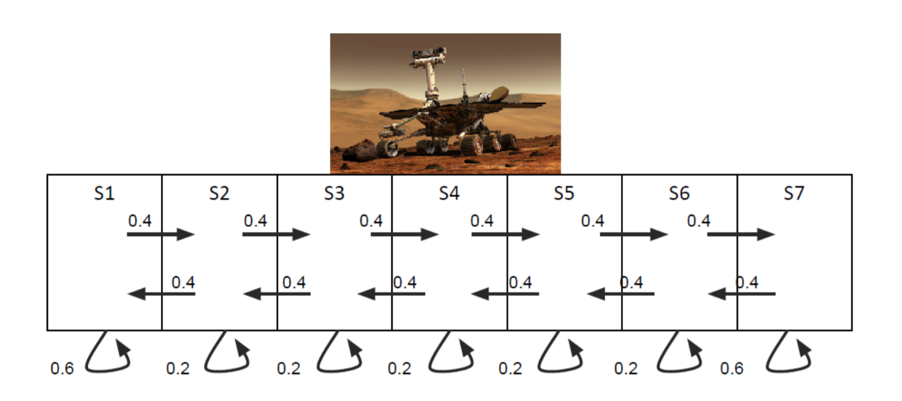

# 课时2 :根据当前的模型做出正确的决策

****

### **3 马尔科夫决策过程(Markov decision process)简介**

在本课时开始之前，我们先回忆一下智能体(agent)的**模型**(model), **策略**(policy) 和**价值函数**(value function)。如果将智能体的状态和动作空间分别表示为 $S$ 和 $A$。那么，我们将有如下的定义:

* **模型** (Model): 模型可以概括为动力学的数学表现形式和智能体与环境互动时所获得的奖励值。它包含两方面的内容:1.从某个状态$s \in S$,采取某个动作$a \in A$,到达后续状态$s'\in S$ 的转移概率 $P(s'|s,a)$。2. 在某个状态$s \in S$ 采取某个动作$a \in A$所获得的奖励值$R(s,a)$ (确定性的或者随机性的)
* **Policy**(策略): 策略是从智能体的状态到动作的映射函数$\pi : S \to A$，策略可以是随机性的或者是确定性的
* **Value function**(价值函数): 价值函数$V^\pi$对应于一个特定的策略$\pi$ 。对于某个状态$s \in S$，它的价值函数为智能体从当前状态s出发,采取某个策略,所获得的未来奖励(乘上折扣因子$\gamma$)的累计和。

同时，我们也来回忆一下上一讲中提到的**马尔科夫性质**(Markov property)的概念。考虑一个随着转变动力学(transition dynamics)演化的随机过程($s_0,s_1,s_2,\dots$)。当且仅当$P(s_i|s_0,\dots,s_{i-1})=P(s_i|s_{i-1}),\forall i=1,2,\dots,i.e. $等式成立时，我们才可以说这个随机过程具有马尔科夫性质。等式可以解释为: 包含当前状态的历史条件下的下一个状态的转移概率等于仅以当前状态为条件下一个状态的转移概率。在这种情况下，当前状态拥有足够多的随机过程的历史数据，然后我们就可以说"未来状态和历史无关，只和当前状态有关"。

在本课时，我们将以这些定义为基础，分别介绍**马尔科夫过程**(MP)和**马尔科夫奖励过程**(MRP)，以及将两者结合的**马尔科夫决策过程**(MDP)。当我们对MDP有了足够了解之后，紧接着会讨论一些可以做出更好决策的算法。

#### 3.1 马尔科夫过程(Markov process)

通常来说，马尔可夫过程是一个满足马尔科夫属性的随机过程，因为我们所说的马尔科夫过程是*"无记忆的"*。在本课时中，我们将会做两个在强化学习过程中应用很普遍的附加假设:

* *有限状态空间* : 马尔科夫过程的状态空间是有限的。对于马尔科夫过程($s_0,s_1,s_2,\dots $)，这意味着,状态空间 $S$ 应该满足 $|S|<\infty$ 。因此，对于所有的马尔科夫过程的实现，我们都有$s_i \in S$ ，其中 $i = 1,2, \dots$
* *稳定的转移概率* : 转移概率和时间是无关的。用数学表达式可解释为 :

$$
\qquad P(s_i = s'|s_{i−1} = s) = P(s_j = s'|s_{j−1} = s),\forall s, s' ∈ S , \forall i, j = 1, 2, \dots \tag{1}\label{eq:1}
$$

除非另有说明，对于本课时中我们即将接触到的任何马尔科夫过程，这两个原则都是成立的。接下来我们将对MP不断扩充，引出马尔科夫奖励过程和马尔科夫决策过程的定义。需要注意的是: 一个满足这些假设的马尔科夫过程有时候也被称为一条*"马尔科夫链(Markov chain)"* , 尽管和马尔科夫链的准确定义有所不同。

对于马尔科夫过程，这些假设产生了对转移动力学不错的特征描述。其中，转移动力学是*一个转移概率矩阵* P ，大小为$|S|  \times |S|$。转移动力学的 $(i,j)$ 项由$P_{ij}=P(j|i)$所获取，$i,j$ 表示任意S的状态。需要注意的是，矩阵$P$ 是一个非负，行随机(row-stochastic)的矩阵，也就是说，每行的和等于1。

从此以后，我们将使用元组$(S,P)​$ 来定义一个马尔科夫过程，其由以下两部分组成:

* $S$ : 一个有限的状态空间
* $P$ : 一个指定的转移概率模型 $P(s'|s)$

**练习 3.1.** (a) 证明 $P$ 是列随机的矩阵。(b) 说明1 是任意一个行随机矩阵的特征值，并且找到一个与之对应的特征向量。(c) 说明对于一个的行随机矩阵的任意特征值有最大绝对值1。

**练习 3.2.** 一个向量$x \in \mathbb{R}^n$的*最大值规范(max-norm)* 或者*无穷大规范(infinity-norm)*可以表示为$||x||_\infty$ ,并且定义为 : $||x||_\infty = max_i|x_i|$。也就是说，它是 $x$ 绝对值的最大值的一个分量。对于一个矩阵$A \in \mathbb{R}^{m\times n}$，定义如下的关系 :
$$
||A||_\infty = {\sup_{x\in \mathbb{R}^n}\\ \small\small x \neq 0}\frac{||Ax||_\infty}{||x||_\infty} \tag{2}\label{eq:2}
$$
(a) 证明 $||A||_\infty$ 满足标准的所有属性。如此定义的关系被称为矩阵的 *诱导无穷大规范(induced infinity norm)*

(b) 证明等式
$$
||A||_\infty = \max_{i=1,\dots,m}\bigg(\sum^n_{j=1}|A_{ij}|\bigg)\tag{3}\label{eq:3}
$$
(c) 推断如果 $A​$ 是行随机矩阵，那么 $||A||_\infty =1​$

(d) 证明对于每一个 $x \in \mathbb{R}^n$ ，都有 $||Ax||_\infty \leq ||A||_\infty||x||_\infty$

##### 3.1.1 马尔科夫过程的一个例子 : 火星漫游者

为了更好的理解，考虑图[1](#figure1)所示的马尔科夫过程。我们的智能体是一个火星漫游者，其状态空间为 $S = \{S1,S2,S3,S4,S5,S6,S7\}​$ 。图中的箭头表示状态的转移概率。举个例子，如果漫游者在当前的时间步中正处在状态 $S4​$ 。下一个时间步，它去往状态 $S3,S4,S5​$ 的概率分别为0.4, 0.2, 0.4。

图1 :火星漫游者马尔科夫过程

